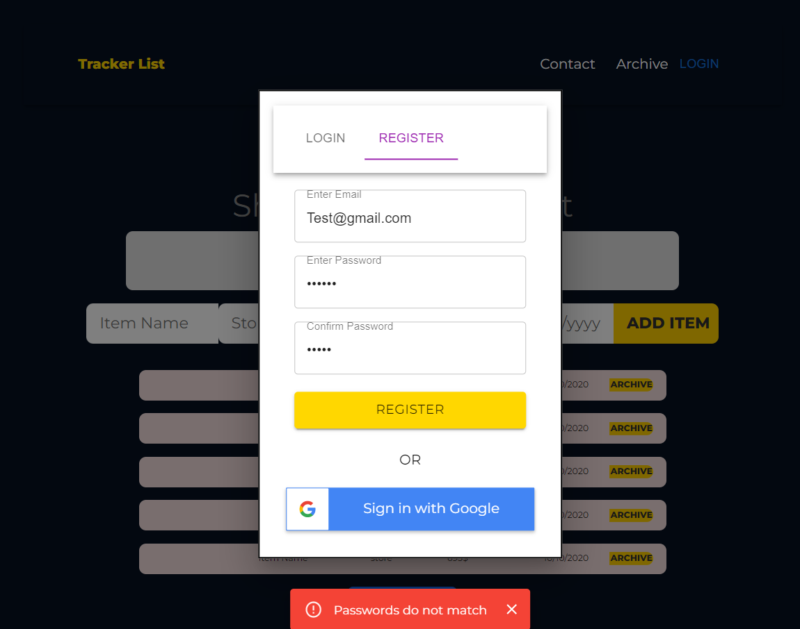
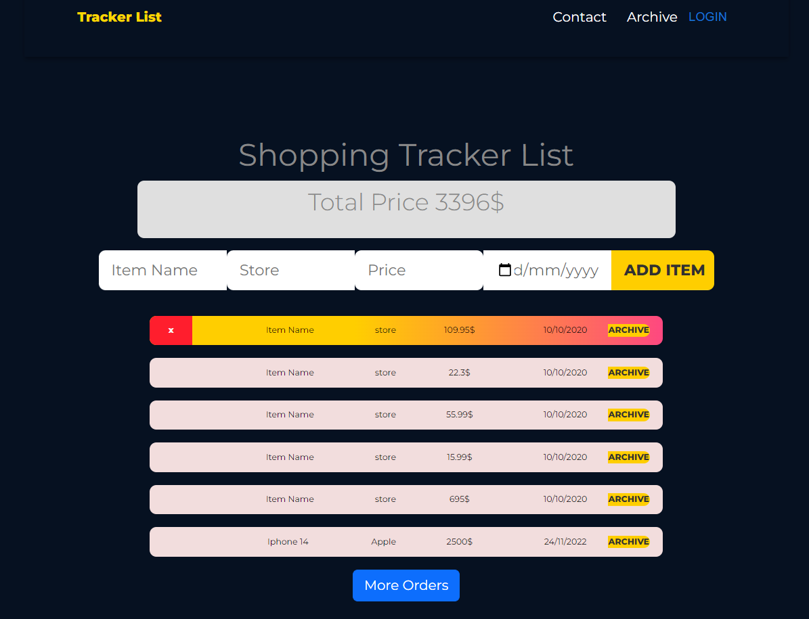
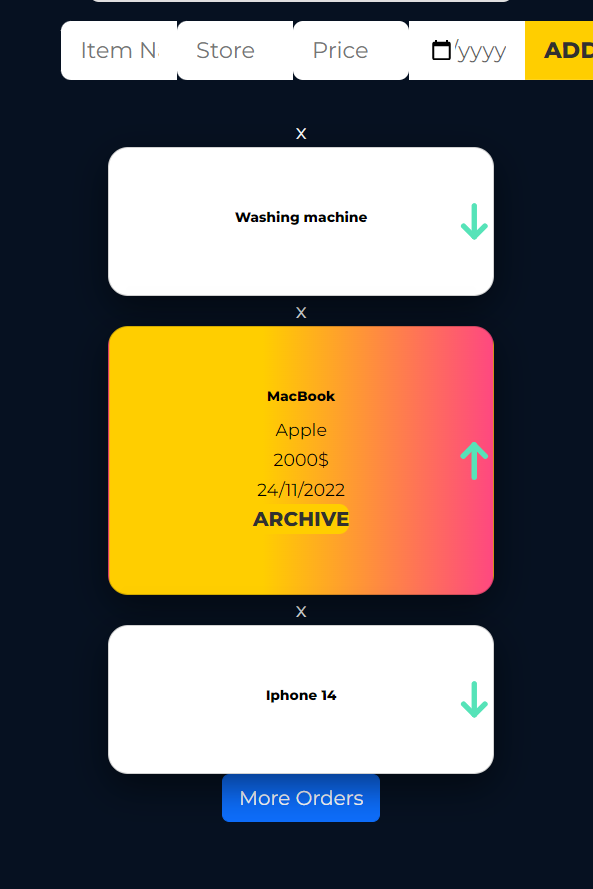
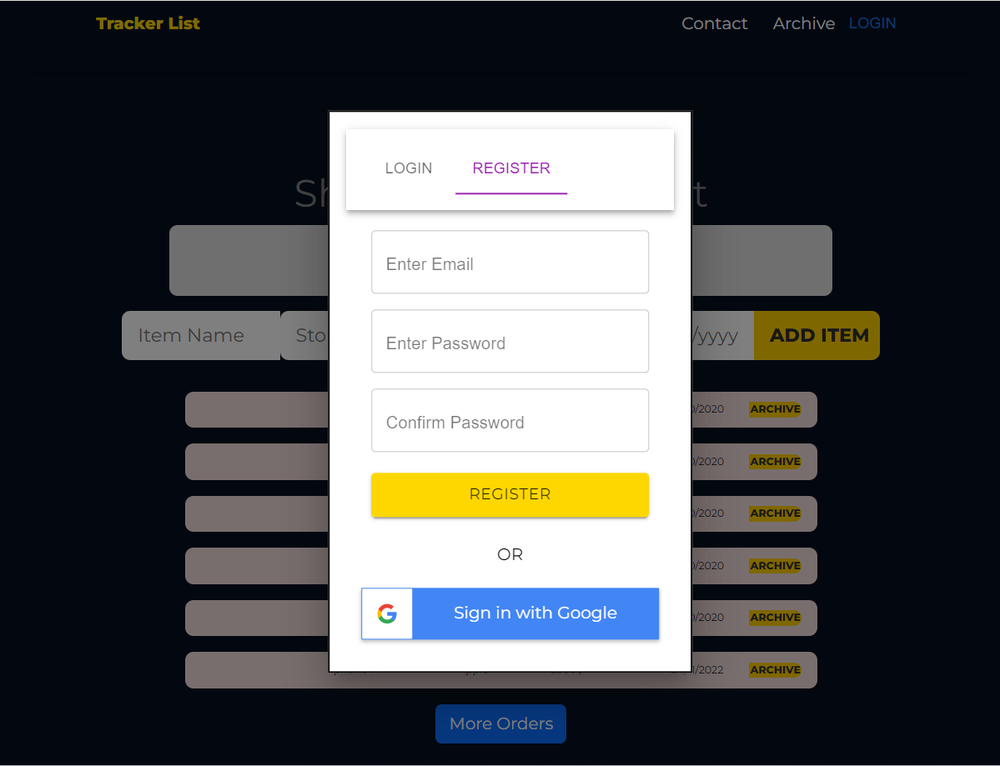
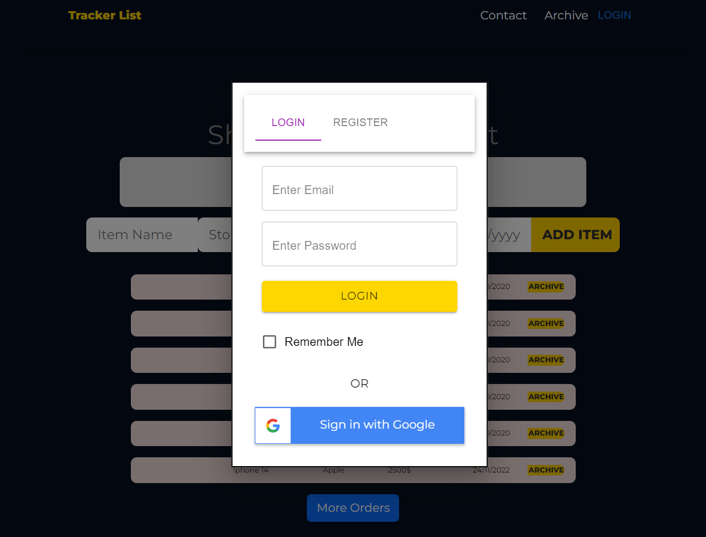
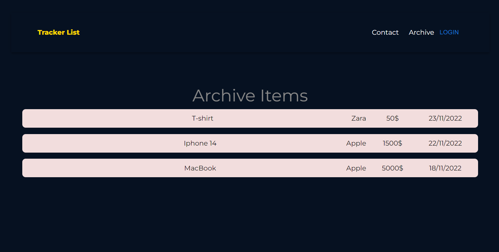

# Shopping Tracking List

This application allows you to track the delivery of your orders, you can view the list of orders that should arrive soon, sorted by date, you can delete orders, the application allows you to click on the archive button and move the item to a new list that will contain all the items delivered.

The main page shows all the items that will arrive soon on the "Archive" page you can view the items that have arrived.

There is an option to register and connect to the application, all details are secured in Firebase.
When registering/login, if you did not enter similar passwords when logging in - a corresponding alert will appear, as well as when logging in errors, etc.
For example :

All items on the main page will be imported from API: "https://fakestoreapi.com/products"
If the API address is incorrect - an error message will be printed.
The site is fully responsive for all devices,

I used Redux to manage the state, and to manage the data that goes out to the "archive" component.

##### Explanation of use of the website:

#### On a computer screen

#### On Mobile

#### Login & Register

#### Archive Items

